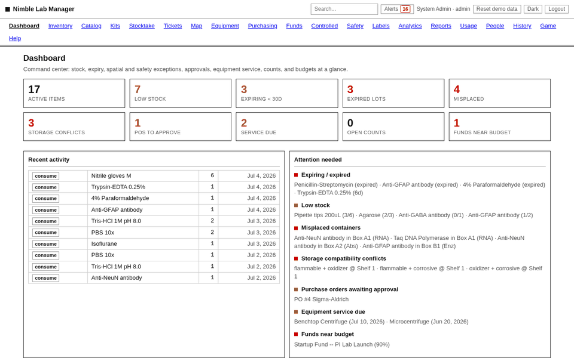
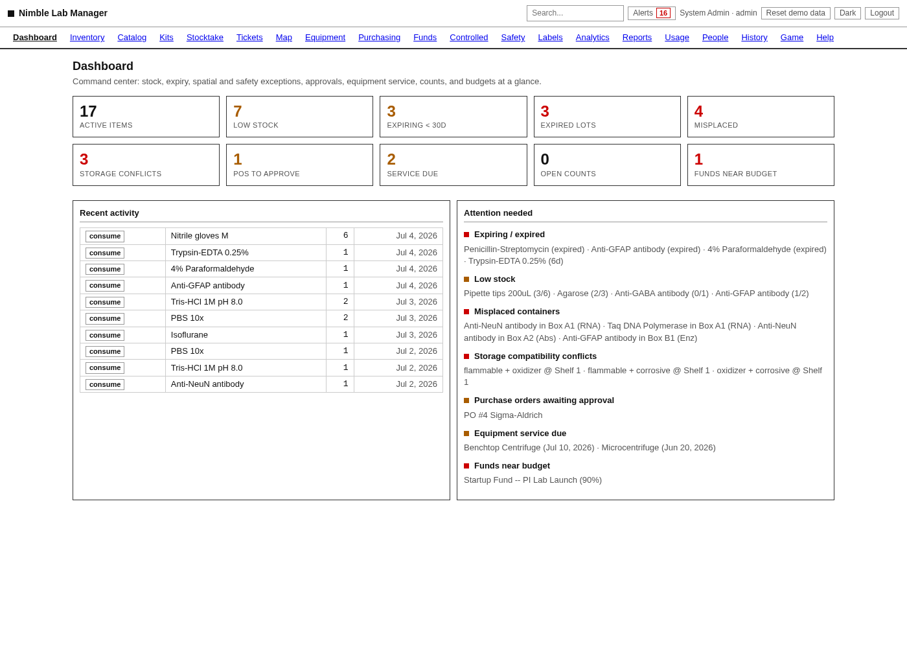
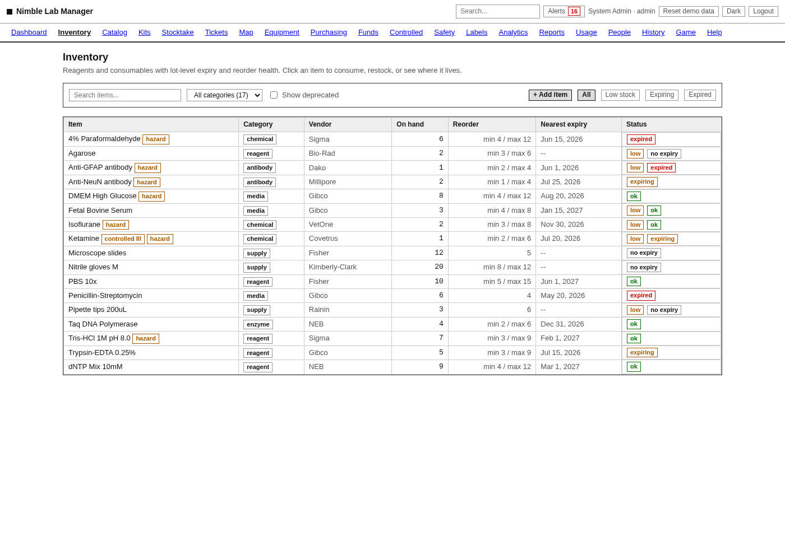
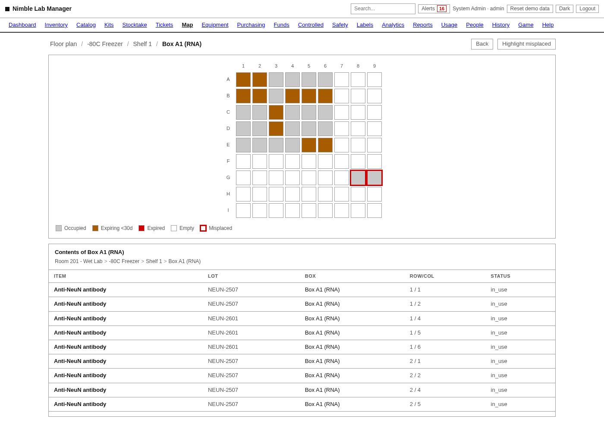
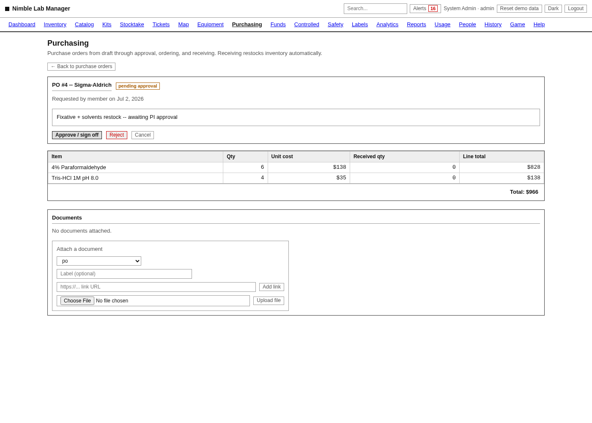
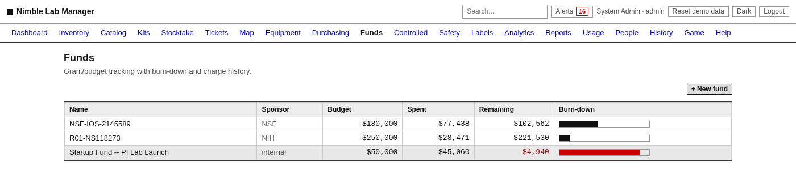
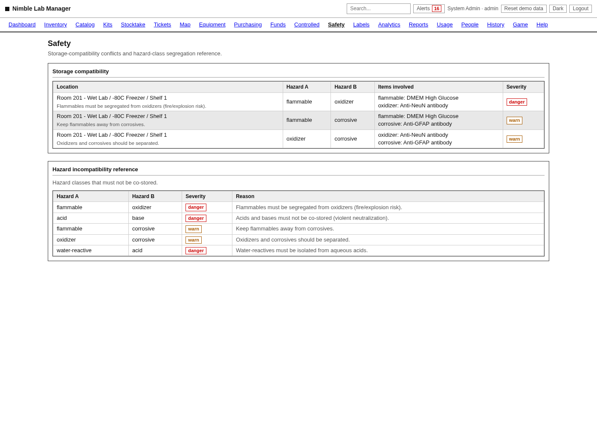
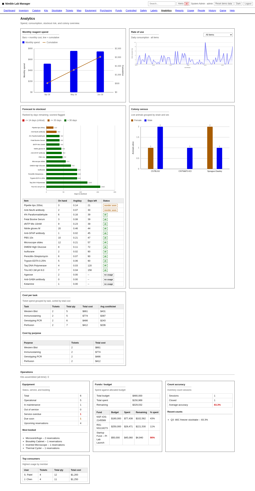
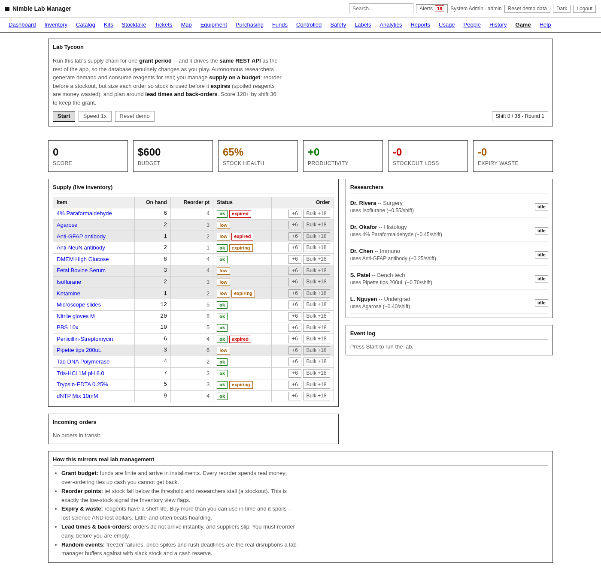

# Nimble Lab Manager

**A map-first inventory and operations platform for a working wet lab -- built to
showcase full-stack engineering and data modelling, and it runs fully offline.**

Nimble Lab Manager answers the question that eats the most time at the bench:
*where is the thing, and is it still good?* Spreadsheets tell you a reagent
exists and roughly how many you have -- but not which shelf of which freezer,
which box, which well -- so people re-buy things they own, thaw expired lots, and
lose an afternoon hunting for a tube misfiled two racks over. This app treats
physical location as a first-class part of the record: it draws the lab as a
clickable schematic down to the individual freezer-box grid, flags what is
expiring or already expired, detects containers sitting in the wrong well, and
forecasts what you are about to run out of. It has since grown past the map into
a fairly complete lab-operations suite -- inventory and lot/expiry tracking,
spatial maps, purchasing with PI approvals, grant-budget burn-down, equipment
booking and maintenance, a controlled-substance register, safety/compatibility
checking, analytics, and an interactive tutorial. It is a portfolio proof-of-concept
built by a former lab manager on a domain I ran for five years, not a toy dataset.

Buildless by design: no npm, no bundler, no CDN, no front-end framework. Clone
and run one command, and it works with the network unplugged.

### Walkthrough

A guided tour of the app: dashboard, inventory and lot detail, the map drilling
into a freezer's contents, purchasing approvals, grant burn-down, safety
conflicts, analytics, kits, the interactive tutorial, and the live alerts feed.



## Screenshots

**Dashboard** -- command center: stock, expiry, spatial and safety exceptions,
approvals, equipment service, counts, and budgets at a glance, plus a live
"attention needed" feed generated from current state.



**Inventory** -- reagents and consumables with lot-level expiry, min-max reorder
math, hazard and controlled-substance flags, and per-item status (ok / low /
expiring / expired).



**Map** -- the headline feature. A hand-drawn SVG floor plan drills room -> unit
-> shelf -> box, where a freezer box renders as a real grid of wells coloured by
state (occupied, expiring, expired, misplaced, empty). The contents table below
shows every lot in the box, including containers flagged as misplaced.



**Purchasing** -- a purchase order in the approval workflow (`draft ->
pending_approval -> approved -> ordered -> received`). Receiving a line creates a
new lot and restocks inventory automatically.



**Funds** -- grant/budget burn-down. Charges from received POs, ticket usage, and
manual entries draw each fund down; the bar turns red as a fund nears its budget.



**Safety** -- a storage-compatibility checker that flags incompatible hazard
classes sharing a location (oxidizers next to flammables, acids next to bases)
with a severity for each, plus the hazard-incompatibility reference behind it.



**Analytics** -- hand-rolled inline-SVG charts (no chart library): monthly spend
with a cumulative line, daily consumption, forecast-to-stockout ranking, and
cost-per-task rollups.



**Interactive tutorial (Lab Tycoon)** -- a hands-on, tick-loop supply-chain sim
where autonomous researcher NPCs generate demand and consume reagents. It is the
teaching entry point for new users: it drives the *same* REST API as the rest of
the app, so every simulated consume and reorder is a real write to the same
database the dashboard reads, and it rehearses the exact planning the tool is
built to encourage.



## Quick start

One command creates a local virtual environment, installs dependencies on first
run, builds `lab.db` from `schema.sql` + `seed.sql`, and starts the server:

```bash
python3 run.py
```

On Windows, `start-nimble.bat` does the same from inside WSL and opens your
browser once the server answers. Then open <http://127.0.0.1:8770>.

Interactive API docs (the FastAPI/OpenAPI explorer) are served at
<http://127.0.0.1:8770/docs>. Use the in-app "Reset demo data" button (or
`POST /api/reset`) to rebuild the database from seed at any time; Ctrl+C stops
the server.

### Logging in

`python3 run.py` starts in **demo mode** and ships four demo accounts, one per
role in the `viewer < member < manager < admin` hierarchy:

| Username  | Password  | Role    |
|-----------|-----------|---------|
| `admin`   | `admin`   | admin   |
| `manager` | `manager` | manager |
| `member`  | `member`  | member  |
| `viewer`  | `viewer`  | viewer  |

The one-click buttons on the login screen fill these in. They exist **only in
demo mode** -- see [Running a real lab (empty start)](#running-a-real-lab-empty-start)
for how a deployed instance starts empty and secure instead, with no well-known
credentials.

Roles gate both the UI (nav items you can't reach are hidden -- People is
admin-only) and the API (every mutating endpoint declares its minimum role
server-side, so the gate can't be bypassed from the browser).

To skip login entirely -- scripting against the API, or a quick local demo -- set
`NLM_AUTH=off` before starting the server:

```bash
NLM_AUTH=off python3 run.py
```

Every request is then treated as an admin session with no cookie required. The
demo data is dated so "today" surfaces the interesting cases: expired and
expiring lots, low-stock reorders, misplaced containers, pending purchase orders,
equipment due for service, and months of consumption history for the analytics.

### Running a real lab (empty start)

Demo mode is opt-in (the `NLM_SEED_DEMO` flag, which `run.py` sets for you). Any
other launch -- Docker, Fly, or a plain `uvicorn` (or `make run-empty`) --
starts with an **empty database and no demo accounts**. On first boot the app
creates a single admin:

- Set `NLM_ADMIN_USER` / `NLM_ADMIN_PASSWORD` beforehand to choose the login, or
- leave them unset and read the one-time generated password from the startup
  logs, then change it in **Admin > People**.

From there you build your own lab: add users, draw your rooms and freezers on the
map, and bulk-import your existing stock (**Admin > Reports > Import**). Because
there is no demo data to wipe, the destructive "Reset demo data" action is
disabled outside demo mode. Cookies are marked `Secure` automatically over HTTPS
(and `fly.toml` sets `NLM_SECURE_COOKIES=1`).

## Feature tour

The SPA has 20 views behind a role-aware left-hand nav, plus a live notification
bell and global search in the top bar.

- **Dashboard** -- command-center counts and a deduplicated "attention needed"
  feed built from live state.
- **Inventory** -- item list and detail: multi-lot expiry, min-max reorder,
  hazard class and CAS number, controlled flag, linked SDS/CoA, printable QR
  label, and consume/restock actions that write `usage_event` rows.
- **Catalog** -- an offline vendor catalog (real catalog numbers, pack sizes,
  prices) with cross-vendor price comparison, one-click add-to-inventory, and
  substitute groups so a backordered vendor falls through to the next-ranked
  alternative.
- **Kits** -- bill-of-materials recipes; assembling a kit depletes every
  component under the same guarded stock path as a manual consume.
- **Stocktake** -- cycle-count sessions against a location, reconciled against
  what the map expects, closing to a count-accuracy KPI.
- **Tickets** -- "work session" records (who used what, and why), optionally
  pre-filled from a reusable task template, feeding the same `usage_event` log.
- **Map** -- clickable SVG floor plan (optionally over an uploaded blueprint)
  drilling to a real box-grid of wells coloured by state.
- **Equipment** -- registry with a reservation calendar and a
  maintenance/calibration log that drives the "service due" count.
- **Purchasing** -- requisition-through-receiving PO workflow with PI sign-off;
  receiving creates lots and restocks; low-stock items surface reorder
  suggestions.
- **Funds** -- grant/budget burn-down with charge history and over-budget flags.
- **Controlled** -- a DEA-style append-only, signed running-balance register per
  controlled item, independent of the ordinary consume/restock trail.
- **Safety** -- storage-compatibility conflict detection across hazard classes.
- **Labels** -- printable QR labels rendered server-side as SVG (via `segno`).
- **Analytics** -- inline-SVG spend, consumption, forecast, and cost-per-task
  charts.
- **Usage** -- per-member usage history with an admin-only vs. everyone
  visibility setting.
- **People** (admin-only) -- create/deactivate users, assign roles, reset
  passwords.
- **History** (manager+) -- the append-only audit trail.
- **Reports** -- summary counts plus role-gated CSV exports.
- **Tutorial** ("Lab Tycoon") -- an interactive, hands-on tutorial: the
  supply-chain sim that teaches the app by writing through the real API.

## Architecture and data model

```
  Browser (buildless SPA, web/)
  +-----------------------------------------------------------+
  |  index.html  ->  js/app.js  (router, api client, ctx)     |
  |  20 vanilla-JS ES-module views, no build step, no CDN     |
  +--------------------------|--------------------------------+
                             |  fetch (JSON over HTTP, same origin)
                             v
  FastAPI  (app/server.py -> app/api.py; auth_router + router under /api)
                             |
                             v
  SQLite   (lab.db, built from schema.sql + seed.sql on first boot)
```

The interesting engineering is in the data layer -- see **[FRAMEWORK.md](FRAMEWORK.md)**
for the full model. Highlights:

- **Spatial hierarchy as an adjacency list.** Locations reference `parent_id`
  and are walked with a **recursive CTE**, so arbitrary-depth room -> freezer ->
  shelf -> rack -> box nesting runs on plain SQLite with no Postgres or `ltree`
  extension. Containers live in wells (row/col) inside boxes; items own multiple
  lots with independent expiry.
- **Race-safe stock updates.** Consuming stock is a single guarded UPDATE --
  `SET quantity_on_hand = quantity_on_hand - ? WHERE item_id = ? AND
  quantity_on_hand >= ?` -- so under concurrent load SQLite serializes the
  writers, each re-checks committed state, and overselling is impossible; a loser
  gets a clean 400 instead of a negative balance. A dedicated concurrency test
  (below) proves this against real parallel HTTP traffic.
- **Auth and roles.** Cookie sessions with **PBKDF2-HMAC-SHA256** password
  hashing (per-user salt, 210k iterations, stdlib-only) and the four-level role
  hierarchy enforced server-side on every mutating endpoint.
- **Audit trail.** Every create/update/consume/restock/settings change appends a
  row to an immutable `audit_log`, surfaced in the History view.

The project began as a pure-SQL exercise, and that layer still stands alone: six
domain tables plus five operational queries in `queries/` (IACUC renewals,
reorder points, colony census, monthly spend with a window function, training
expiry) run with nothing but the `sqlite3` CLI. The web app's analytics reuse
that exact logic, so the SPA and the raw SQL always tell the same story.

`generate_data.py` fabricates a larger, self-consistent lab "world" into a fresh
SQLite DB (stdlib-only, seeded and date-anchored for full reproducibility) so the
map, forecasts, and alerts all light up and the schema is shown to scale beyond
the hand-written seed.

### Demo catalog (real molecular-biology products)

For demos, the repo ships a curated catalog of **~100 real molecular-biology
products** in [`molbio_catalog.py`](molbio_catalog.py) -- polymerases (Taq, Q5,
Phusion), restriction enzymes (EcoRI-HF, BamHI-HF, ...), ligases, prep kits
(QIAprep, RNeasy, Monarch, Qubit, TRIzol), competent cells, DNA ladders, common
buffers and chemicals with **real CAS numbers** (SDS, DTT, TEMED, phenol:chloroform,
ethidium bromide, ...), media, antibiotics, antibodies, and plasticware. Catalog
numbers use each vendor's real product codes where known.

Build a demo database that loads it (plus a few thousand realistic bulk rows so
search, filtering, and pagination have something to chew on):

```bash
make demo                                                   # via the Makefile, or:
python3 generate_data.py --force --molbio                   # the ~100 curated products
python3 generate_data.py --force --molbio --catalog 5000    # + realistic bulk for scale
```

Then start the app and open **Inventory > Catalog** to browse it (and "Add to
inventory" from it). The bulk rows reuse the real chemical identities, so the same
reagent shows up from several vendors at different pack sizes and prices -- like a
real cross-vendor catalog. `make reset` restores the standard feature-demo seed.

## Testing and quality

**263 automated tests** back the app, run with `pytest` against FastAPI's
in-process `TestClient` -- each test gets its own temporary SQLite database, so
running the suite never touches your development `lab.db`:

```bash
pip install -r requirements.txt -r requirements-dev.txt   # or into .venv
python -m pytest -q
```

The suite is deliberately broad:

- **Unit + role/security tests** -- item/lot/expiry math, first-expiry-first lot
  drain, the on-hand floor at zero, the full `viewer < member < manager < admin`
  gate, `NLM_AUTH=off` open mode, and the security surface (`test_security.py`).
- **OpenAPI property/fuzz testing (Schemathesis)** -- for every operation in the
  app's own OpenAPI schema, Schemathesis synthesises boundary values, wrong
  types, missing fields, and oversized inputs and asserts the server never
  returns a 5xx. This **found and drove fixes for two real 5xx bug classes**: an
  unbounded-integer path/query parameter that overflowed SQLite's 8-byte range
  (now answered as 400), and a CSV exporter that crashed on NUL bytes in stored
  free-text (now scrubbed). Both are locked in as regression guards.
- **Accessibility audits (axe-core)** -- Playwright renders the key views and
  runs axe-core, asserting **zero critical or serious** WCAG violations.
- **Playwright end-to-end** -- a browser-driven smoke test of the real SPA
  against a live in-process server.
- **Concurrency stress test** (`test_concurrency.py`) -- fires a burst of
  parallel consumes at limited stock and asserts exactly `floor(stock / qty)`
  winners, no oversell, no negative balance, and no 5xx -- a real integration
  proof of the guarded-UPDATE race safety described above.

Security hardening is tested, not just claimed: **CSRF** double-submit cookie
tokens on mutating requests, a **Content-Security-Policy** plus
`X-Frame-Options: DENY`, and a sliding-window **login rate limit** (429 after
repeated failures).

## Tech stack

- **Backend:** Python 3, FastAPI + uvicorn, SQLite (single `lab.db` file).
  QR generation uses `segno` (pure-Python), so even labels stay offline.
- **Frontend:** vanilla-JavaScript ES modules -- no build step, no framework.
  Floor plan, box grids, and analytics charts are all hand-rolled inline SVG.
  FastAPI serves the static `web/` directory directly: one process, one port.
- **Auth:** cookie sessions, PBKDF2-hashed passwords, four-level roles, with an
  `NLM_AUTH=off` escape hatch for open local access.
- **No build step, no CDN, no external runtime dependencies at the browser** --
  the whole thing works fully offline.

## Deploy

A `Dockerfile` + `docker-compose.yml` (`docker compose up --build`, then
<http://localhost:8770>) and a ready-to-edit `fly.toml` ship in the repo root.
Both start **empty and secure** -- the schema builds on first boot and a single
admin is bootstrapped (see [Running a real lab](#running-a-real-lab-empty-start));
set `NLM_SEED_DEMO=1` if you instead want the throwaway demo lab. A mounted
volume (`nlm-data` / `nlm_data`, at `/data`) keeps `lab.db` across rebuilds. A
single SQLite file means a single machine -- the right shape for this workload.

## Contributing and license

See `CONTRIBUTING.md` for setup and conventions, and the `Makefile` for common
tasks (`make help`). Licensed under the MIT License -- see `LICENSE`.
